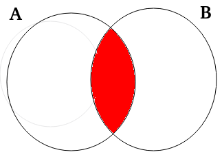

# Join - união entre tabelas do MySQL

Para outros SGBD os comandos sãos emelhantes, com epquenas variações.

Para isto usa-se o conhecimento da teoria dos conjuntos, da matemática.

Existem basicamente 3 variações de join: inner join, left join e right join. Outras fromas apenas mostram uma melhor escrita do código.

Vamos trabalhar com duas tabelas: a e b, para ficar mais simples de aplicar/explicar os conceitos.
```sql
create database joins;

use joins;

create table a (name varchar(50) primary key);

create table b (name varchar(50) primary key);

insert into a (name) values ('Ribamar FS'), ('Fátima EF'), ('Tiago EF'), ('Elias EF');

insert into b (name) values ('Ribamar FS'), ('Fátima EF'), ('João Brito'), ('Pedro Brito');
```
## Inner Join

Retorna os registros comuns (intersecção) das duas tabelas.



### SQL
```sql
SELECT a.name, b.name
FROM a /* a é a tabela da esquerda/left */
INNER JOIN b /* b é a tabela da direita/right */
ON a.name = b.name
```
### Retorna:
```sql
name	name
Fátima EF	Fátima EF
Ribamar FS	Ribamar FS
```

## Left Join

Retorna todos os registros que estão somente em a mais os registros que estão na intersecção das duas tabelas/conjuntos.


### SQL
```sql
SELECT a.name, b.name
FROM a
LEFT JOIN b
ON a.name = b.name
```
### Retorno:
```sql
name	name
Elias EF	NULL
Fátima EF	Fátima EF
Ribamar FS	Ribamar FS
Tiago EF	NULL
```
Veja que de a retorna todos e de b somente aqueles que coincidem com os da a.

## Right Join

Retorna todos os registros que estão somente em b, mais os registros que estão ao mesmo tempo nas duas tabelas/intersecção.


### SQL 
```sql
SELECT a.name, b.name
FROM a
RIGHT JOIN b
ON a.name = b.name
```
### Retorno:
```sql
name	name
Fátima EF	Fátima EF
NULL	João Brito
NULL	Pedro Brito
Ribamar FS	Ribamar FS
```

## Outer Join ou Full Outer Join ou ainda Full Join

Retorna todos os registros que estão somente em a, mais todos os registros de b e também os registros que estão ao mesmo tempo nas duas tabelas/intersecção.


### SQL 

Não existe o comando OUTER JOIN no MySQL, então usamos um workaround/artifício/gambiarra:

```sql
SELECT a.name, b.name
FROM a
LEFT JOIN b
ON a.name = b.name
UNION
SELECT a.name, b.name
FROM a
RIGHT JOIN b
ON a.name = b.name
```

### Retorno:
```sql
name	name
Elias EF	NULL
Fátima EF	Fátima EF
Ribamar FS	Ribamar FS
Tiago EF	NULL
NULL	João Brito
NULL	Pedro Brito
```
Nas construções dos joins também podemos usar outros comandos: WHERE, ORDER BY, LIKE, etc.
